# DOKUMENTASI LENGKAP: ALUR & CARA KERJA SISTEM OCR KTP

Proyek: RT Digital — Ekstraksi KTP Otomatis & Buku Tamu Pengunjung  
Arsitektur: Flutter Web/Mobile Frontend <-> PHP RESTful Backend <-> Python Engine (OpenCV & PaddleOCR) <-> MySQL Database  

---

## 1. Diagram Alur Kerja OCR KTP (Top-Down Flowchart)

Diagram alur kotak-kotak ke bawah dari awal inisialisasi dan pemilihan gambar hingga data tampil di antarmuka pengguna:

```mermaid
flowchart TD
    subgraph S1 ["1. Frontend Layer (Flutter Dart)"]
        A1["1. Petugas Membuka Kamera / File Explorer<br>File: lib/screens/oct_ktp.dart (Baris 171-207)<br>Fungsi: _pickImage()<br>Library: image_picker"]
        --> A2["2. Validasi File di Sisi Klien<br>File: lib/screens/oct_ktp.dart (Baris 184-190)<br>Aturan: Format Gambar (JPG/PNG/WEBP) & Ukuran Maksimal 8 MB"]
        --> A3["3. Mengirim Request HTTP Multipart POST<br>File: lib/screens/oct_ktp.dart (Baris 247-262)<br>Fungsi: _scan()<br>URL Target: lib/url.dart (ApiUrls.ocrBaseUrl) -> POST /api/ocr/scan<br>Payload: Field 'image' (MultipartFile bytes)<br>Library: http, http_parser"]
    end

    subgraph S2 ["2. Backend Routing & Gateway (PHP)"]
        A3 --> B1["4. Menerima Request & Routing API<br>File: backend/index.php (Baris 53, 151-155)<br>Fungsi: ResponseHelper::enableCors() & Route Match /api/ocr/scan"]
        --> B2["5. Validasi MIME Type & Simpan File Fisik<br>File: backend/controllers/OcrController.php (Baris 68-94)<br>Service: backend/services/ImageService.php (Baris 59-136)<br>Fungsi: ImageService::processImage() -> handleUploadedFile()<br>Lokasi Simpan: backend/storage/uploads/ktp_YYYYMMDD_HHMMSS_*.jpg<br>Library: PHP ext-fileinfo"]
        --> B3["6. Konversi Gambar ke Base64 Data URI<br>File: backend/services/ImageService.php (Baris 120-124)<br>Fungsi: fileToBase64()<br>Format: data:image/jpeg;base64,... (Untuk kolom foto_ktp)"]
        --> B4["7. Deteksi Binary Python Virtual Environment (venv)<br>File: backend/services/OcrService.php (Baris 68-118)<br>Fungsi: detectPythonExecutable()<br>Target: backend/venv/Scripts/python.exe (Win) atau backend/venv/bin/python (Linux)"]
        --> B5["8. Eksekusi Subprocess Python via 2 Pipe<br>File: backend/services/OcrService.php (Baris 143-171)<br>Fungsi: scanKtp()<br>Perintah: proc_open([python, ktp_quick_scan.py, img_path, 'none'])<br>Pipe 1: stdout (Output JSON Teks)<br>Pipe 2: stderr (Log Warning / Error)<br>Fungsi PHP: proc_open(), stream_get_contents(), proc_close()"]
    end

    subgraph S3 ["3. Python OCR Core Engine"]
        B5 --> C1["9. Mulai Algoritma Quick Scan Iteratif<br>File: OCR-Script/ktp_quick_scan.py (Baris 213-285)<br>Fungsi: run_ktp_quick_scan()<br>Strategi: Iterasi 1 ('none') -> Iterasi 2 ('adaptive') -> Iterasi 3 ('ktp_optimized')"]
        --> C2["10. Pra-pemrosesan Citra Bertahap (OpenCV)<br>File: OCR-Script/preprocess_adaptive.py (Baris 15-154)<br>Tahap 1: Auto-resize jika > 1600px (cv2.INTER_AREA)<br>Tahap 2: Grayscale + Bilateral Filter + Adaptive Threshold<br>Tahap 3: Deskewing (Rotasi Sudut) + CLAHE Kontras<br>Library: opencv-python-headless (cv2), numpy, pillow"]
        --> C3["11. Inferensi Deteksi & Pembacaan Teks (PaddleOCR AI)<br>File: OCR-Script/ocr_processor.py (Baris 298-348)<br>Fungsi: process_document()<br>Model 1: PP-OCRv5_mobile_det (DBNet - Deteksi Kotak Teks)<br>Model 2: latin_PP-OCRv5_mobile_rec (SVTR/CRNN - Baca Karakter)<br>Library: paddleocr, paddlepaddle"]
        --> C4["12. Post-Processing & Ekstraksi Struktur Data KTP<br>File: OCR-Script/ocr_processor.py (Baris 73-295, 350-432)<br>File: OCR-Script/ktp_quick_scan.py (Baris 64-210)<br>Fungsi: extract_ktp_fields_spatial(), sanitize_name(), parse_ktp_details()<br>Rule Dukcapil: Ekstraksi NIK 16 digit, TTL, Gender, Alamat Gabungan"]
        --> C5["13. Evaluasi Early Stopping<br>File: OCR-Script/ktp_quick_scan.py (Baris 280-282)<br>Kondisi: NIK 16 digit angka murni DAN Nama terdeteksi valid<br>Aksi: BREAK loop seketika (Hemat CPU, waktu hanya 3-5 detik)"]
        --> C6["14. Cetak JSON ke Stream Output<br>File: OCR-Script/ktp_quick_scan.py (Baris 315-322)<br>Aksi: print(json.dumps(hasil)) ke sys.stdout"]
    end

    subgraph S4 ["4. Database & Pengiriman Respon (PHP)"]
        C6 --> D1["15. Membaca Stream Pipe & Deserialisasi JSON<br>File: backend/services/OcrService.php (Baris 182-198)<br>Fungsi: mb_convert_encoding() & json_decode()<br>Library: PHP ext-mbstring, ext-json"]
        --> D2["16. Auto-Save ke Database MySQL<br>File: backend/controllers/OcrController.php (Baris 108-123)<br>Model: backend/models/KtpModel.php (Baris 81-118)<br>Fungsi: KtpModel::create()<br>Tabel: demo_ocr_ktp (nama, nik, alamat, foto_ktp, no_kavling, metadata, jam_masuk)<br>Library: PHP ext-pdo, ext-pdo_mysql"]
        --> D3["17. Mengirim Respon HTTP 200 JSON ke Klien<br>File: backend/helpers/ResponseHelper.php (Baris 62-88)<br>Fungsi: ResponseHelper::success()<br>Output: JSON berstandar uniform {success: true, message: ..., data: ...}"]
    end

    subgraph S5 ["5. Form Auto-Fill & Konfirmasi Petugas (Frontend)"]
        D3 --> E1["18. Terima Respon & Isi Otomatis Field Form<br>File: lib/screens/oct_ktp.dart (Baris 262-286)<br>Fungsi: _scan()<br>Target: _ctrl['nama'], _ctrl['nik'], _ctrl['alamat'], simpan _ktpId = data['id']"]
        --> E2["19. Segarkan Tabel Riwayat Pengunjung<br>File: lib/screens/oct_ktp.dart (Baris 293)<br>Fungsi: _fetchList() memanggil GET /api/ktp"]
        --> E3["20. Petugas Mengisi No. Kavling & Simpan Final<br>File: lib/screens/oct_ktp.dart (Baris 314-355)<br>Fungsi: _simpan()<br>Request: PUT /api/ktp/{id} membawa JSON {nama, nik, alamat, no_kavling}"]
    end
```



---

## 2. Rincian Teknis Step-by-Step

### Langkah 1: Input & Pemilihan Foto KTP
- **File:** `lib/screens/oct_ktp.dart`
- **Baris:** 171 – 207
- **Fungsi:** `Future<void> _pickImage(ImageSource source)`
- **Library:** `image_picker`
- **Penjelasan Teknis:**
  Petugas memilih input (Kamera langsung atau File Explorer / Galeri). `image_picker` memanggil API native perangkat dengan konfigurasi `maxWidth: 2400` dan `imageQuality: 92`. Format file dibatasi ke format citra oleh file picker native. Dilakukan validasi lokal pada baris 184–190 agar ukuran file tidak melebihi 8 MB (`maxImageBytes = 8 * 1024 * 1024`). File dibaca menjadi `Uint8List bytes` di memori dan ditampilkan ke widget `Image.memory`.

---

### Langkah 2: Pengiriman HTTP Request Multipart ke Backend
- **File:** `lib/screens/oct_ktp.dart` (URL target dibaca dari `lib/url.dart`)
- **Baris:** 247 – 262
- **Fungsi:** `Future<void> _scan()`
- **Library:** `package:http/http.dart` dan `package:http_parser/http_parser.dart`
- **Penjelasan Teknis:**
  1. Frontend membentuk objek `http.MultipartRequest('POST', Uri.parse('$_base$endpointScan'))`.
     - `_base` diambil dari getter baris 46–52 yang merujuk pada `ApiUrls.ocrBaseUrl` di `lib/url.dart`.
     - `endpointScan` bernilai `'ocr/scan'` (baris 54).
  2. File citra KTP dilampirkan menggunakan field key `'image'` (`fieldFoto` baris 56):
     ```dart
     request.files.add(
       http.MultipartFile.fromBytes(
         'image',
         bytes,
         filename: name,
         contentType: _mediaType(name),
       ),
     );
     ```
  3. **Klarifikasi Parameter `no_kavling` & `auto_save`:**
     - Pada request `_scan()` awal, Flutter **hanya mengirimkan file `image`**.
     - Parameter `auto_save`: Tidak perlu dikirim manual oleh Flutter, karena backend (`OcrController.php` baris 79–83) secara otomatis menerapkan nilai bawaan `true` (`$autoSaveParam = $input['auto_save'] ?? $_POST['auto_save'] ?? true;`). Dengan demikian, backend otomatis mencatat data hasil scan ke database.
     - Parameter `no_kavling`: Pada tahap awal scan memang bernilai kosong (`null`), karena nomor kavling tujuan diinput secara manual oleh petugas keamanan di layar setelah data nama dan NIK KTP terbaca.
  4. Request dikirimkan menggunakan `request.send()` dengan timeout 90 detik.

---

### Langkah 3: Penerimaan Request & Routing di Backend PHP
- **File:** `backend/index.php` dan `backend/helpers/ResponseHelper.php`
- **Baris:** `index.php` baris 53 & 151–155; `ResponseHelper.php` baris 35–53
- **Fungsi:** `ResponseHelper::enableCors()` dan routing handler `/api/ocr/scan`
- **Library:** Standard PHP Built-in
- **Penjelasan Teknis:**
  1. Server menerima request HTTP POST. `ResponseHelper::enableCors()` menyetel header CORS dan `Access-Control-Allow-Private-Network: true` untuk mengizinkan akses dari browser dan aplikasi Flutter.
  2. Router mencocokkan URI `$path === '/api/ocr/scan'` dan method `POST`, lalu membuat instance `Controllers\OcrController` dan memanggil method `scan()`.

---

### Langkah 4: Validasi MIME Type & Penyimpanan Citra
- **File:** `backend/controllers/OcrController.php` dan `backend/services/ImageService.php`
- **Baris:** `OcrController.php` baris 70–94; `ImageService.php` baris 59–136
- **Fungsi:** `OcrController::scan()` -> `ImageService::processImage()` -> `handleUploadedFile()`
- **Library:** PHP `ext-fileinfo` (`finfo_open`, `finfo_file`)
- **Penjelasan Teknis:**
  1. `OcrController` mengambil file dari `$_FILES['image']`.
  2. `ImageService::handleUploadedFile()` memeriksa keaslian file dengan membaca magic bytes via `finfo_file` (bukan sekadar melihat nama ekstensi). Hanya MIME type `image/jpeg`, `image/jpg`, `image/png`, dan `image/webp` yang diperbolehkan.
  3. File dipindahkan ke `backend/storage/uploads/ktp_YYYYMMDD_HHMMSS_<hash>.jpg`.
  4. File fisik dibaca dan dikonversi ke Base64 Data URI (`data:image/jpeg;base64,...`) pada baris 120–124 untuk disimpan ke database pada kolom `foto_ktp`.

---

### Langkah 5: Deteksi Python venv & Eksekusi Subprocess Pipe
- **File:** `backend/services/OcrService.php`
- **Baris:** Baris 68–118 (`detectPythonExecutable`) dan baris 128–180 (`scanKtp`)
- **Fungsi:** `OcrService::detectPythonExecutable()` dan `OcrService::scanKtp(string $imagePath)`
- **Library:** PHP Process Execution (`proc_open`, `stream_get_contents`, `proc_close`)
- **Penjelasan Teknis:**
  1. `detectPythonExecutable()` mendeteksi interpreter Python di dalam folder virtual environment (`backend/venv/Scripts/python.exe` pada Windows atau `backend/venv/bin/python` pada Linux). Jika path khusus didefinisikan pada `.env` (`PYTHON_PATH`), maka nilai tersebut yang diprioritaskan.
  2. `scanKtp()` menyusun perintah command-line:
     ```
     [python_binary] OCR-Script/ktp_quick_scan.py "[image_path]" none
     ```
  3. Menjalankan proses dengan `proc_open()` dan membuka 2 jalur komunikasi (pipe):
     - **Pipe 1 (`stdout`)**: Saluran penangkap output teks string JSON dari script Python.
     - **Pipe 2 (`stderr`)**: Saluran penangkap log error atau pesan warning OpenCV/Paddle.
  4. Stream `stdin` (pipe 0) langsung ditutup karena proses OCR tidak membutuhkan input interaktif.

---

### Langkah 6: Pra-pemrosesan Citra (OpenCV Preprocessing) & Algoritma Quick Scan
- **File:** `OCR-Script/ktp_quick_scan.py` dan `OCR-Script/preprocess_adaptive.py`
- **Baris:** `ktp_quick_scan.py` baris 213–285 (`run_ktp_quick_scan`); `preprocess_adaptive.py` baris 15–154
- **Fungsi:** `run_ktp_quick_scan()`, `resize_if_needed()`, `preprocess_adaptive()`, `preprocess_ktp_optimized()`
- **Library:** `opencv-python-headless` (`cv2`), `numpy`, `pillow` (`PIL`)
- **Penjelasan Teknis & Mekanisme Kerja:**
  Preprocessing dijalankan di dalam alur Quick Scan secara bertahap (satu per satu secara iteratif) menggunakan sistem **Early Stopping** untuk efisiensi komputasi CPU:
     - **Iterasi 1 — Metode `'none'` (Citra Asli):**
       - Hanya menjalankan `resize_if_needed()` (baris 15–54) untuk memperkecil resolusi foto kamera berukuran raksasa (> 1600px) menjadi maksimal 1600px menggunakan interpolasi `cv2.INTER_AREA`. Hal ini menghemat beban komputasi CPU sebesar 60–80% tanpa menurunkan akurasi baca huruf.
       - Gambar asli langsung diuji ke model PaddleOCR (`process_document()`).
       - **Kondisi Berhenti (Early Stopping):** Baris 280–282 mengecek:
         `if len(nik) == 16 and nik.isdigit() and nama != "Tidak Terdeteksi": break`
         Jika foto KTP sudah jelas/terang, NIK 16 digit angka dan Nama langsung ditemukan, maka loop **SEKETIKA BERHENTI (BREAK)**. Waktu pemrosesan hanya ~3–5 detik. Filter OpenCV lainnya tidak pernah dipanggil.
     - **Iterasi 2 — Metode `'adaptive'`:**
       - Jika iterasi 1 gagal menemukan NIK/Nama yang valid (misal karena bayangan atau pencahayaan gelap), sistem beralih ke `preprocess_adaptive()` (baris 67–79):
         1. **Grayscale:** Konversi BGR ke 1 kanal abu-abu (`cv2.cvtColor`).
         2. **Adaptive Thresholding:** Menghitung threshold lokal per blok piksel (`cv2.adaptiveThreshold` metode `ADAPTIVE_THRESH_GAUSSIAN_C`), mengubah huruf menjadi hitam dan latar bermotif KTP menjadi putih bersih.
         3. **Fast Denoising:** Membersihkan bintik noise (`cv2.fastNlMeansDenoising`).
       - Hasil biner diuji kembali ke AI. Jika NIK & Nama valid -> **BREAK**.
     - **Iterasi 3 — Metode `'ktp_optimized'`:**
       - Jika masih belum valid, dijalankan `preprocess_ktp_optimized()` (baris 118–154):
         4. **Deskewing (Koreksi Kemiringan):** Menghitung koordinat teks, menentukan sudut rotasi via `cv2.minAreaRect`, dan memutar citra via `cv2.warpAffine` agar posisi kartu tegak lurus sempurna.
         5. **CLAHE:** Menormalkan kontras dan meredam efek pantulan silau flash/lampu.
         6. **Adaptive Thresholding + Denoising lanjutan.**

---

### Langkah 7: Deteksi & Pembacaan Teks AI (PaddleOCR)
- **File:** `OCR-Script/ocr_processor.py` (dipanggil oleh `ktp_quick_scan.py` baris 248)
- **Baris:** 298 – 348
- **Fungsi:** `process_document(image_path: str)`
- **Library:** `paddleocr` dan `paddlepaddle`
- **Penjelasan Teknis:**
  Model deep learning PaddleOCR menjalankan 2 tahap:
  1. **Text Detection (DBNet / `PP-OCRv5_mobile_det`):** Memindai citra dan menghasilkan koordinat kotak pembatas (`rec_boxes`) dari setiap baris teks pada KTP.
  2. **Text Recognition (SVTR / CRNN / `latin_PP-OCRv5_mobile_rec`):** Meng-crop area bounding box secara virtual dan membaca karakter huruf/angka dengan kamus karakter latin Indonesia, menghasilkan daftar teks mentah (`rec_texts`) dan tingkat keyakinan (`rec_scores`).

---

### Langkah 8: Post-Processing & Ekstraksi Logika Spasial KTP
- **File:** `OCR-Script/ocr_processor.py` dan `OCR-Script/ktp_quick_scan.py`
- **Baris:** `ocr_processor.py` baris 73–295 & 350–432; `ktp_quick_scan.py` baris 64–210
- **Fungsi:** `extract_ktp_fields_spatial()`, `sanitize_name()`, `validate_value()`, `parse_ktp_details()`
- **Library:** Built-in Python (`re`, `datetime`, `json`)
- **Penjelasan Teknis:**
  1. **Spatial Box Clustering:** Mengelompokkan kotak teks berdasarkan posisi koordinat Y (baris) sesuai struktur baku formulir KTP Indonesia (NIK -> Nama -> Tempat/Tgl Lahir -> Jenis Kelamin -> Alamat -> RT/RW -> Kel/Desa -> Kecamatan -> Agama -> Status -> Pekerjaan -> Kewarganegaraan).
  2. **Sanitasi Nama:** Membersihkan string nama dari kebocoran label template seperti `PROVINSI`, `KABUPATEN`, `NIK`, angka, dan token karakter berulang (`sanitize_name()`).
  3. **Ekstraksi Standar NIK Dukcapil:** Memvalidasi 16 digit angka NIK. Mengekstrak tanggal lahir dan jenis kelamin otomatis dari NIK (jika tanggal > 40, menandakan jenis kelamin perempuan dan tanggal dikurangi 40).
  4. **Penggabungan Alamat:** Menggabungkan kolom Jalan, RT/RW, Kelurahan, dan Kecamatan menjadi satu kesatuan alamat lengkap.
  5. Hasil dikonversi ke format JSON dan dicetak ke stream `sys.stdout` pada baris 315–322.

---

### Langkah 9: Deserialisasi, Penyimpanan Database & Respon API
- **File:**
  - `backend/services/OcrService.php` (Baris 182–219)
  - `backend/controllers/OcrController.php` (Baris 108–143)
  - `backend/models/KtpModel.php` (Baris 81–118)
  - `backend/helpers/ResponseHelper.php` (Baris 62–88)
- **Fungsi:** `OcrService::scanKtp()` -> `KtpModel::create()` -> `ResponseHelper::success()`
- **Library:** PHP `ext-json`, `ext-mbstring`, `ext-pdo`, `ext-pdo_mysql`
- **Penjelasan Teknis:**
  1. `OcrService` membaca string dari pipe stdout, membersihkan karakter non-UTF8 via `mb_convert_encoding()`, dan melakukan `json_decode()`.
  2. `OcrController` menerima data hasil ekstraksi. Karena `$isAutoSave` bernilai `true`, controller memanggil `KtpModel::create()` untuk menyimpan record baru ke tabel MySQL `demo_ocr_ktp`:
     ```sql
     INSERT INTO demo_ocr_ktp (nama, nik, alamat, foto_ktp, no_kavling, metadata, jam_masuk)
     VALUES (:nama, :nik, :alamat, :foto_ktp, :no_kavling, :metadata, :jam_masuk);
     ```
  3. `ResponseHelper::success($responsePayload, ...)` mengirimkan respon HTTP 200 JSON dengan format:
     ```json
     {
       "success": true,
       "message": "Scan KTP berhasil diproses",
       "data": {
         "id": 12,
         "nama": "...",
         "nik": "3201...",
         "alamat": "...",
         "foto_ktp": "data:image/jpeg;base64,...",
         "no_kavling": null,
         "metadata": { ... },
         "jam_masuk": "2026-10-02 13:45:00",
         "is_saved": true
       }
     }
     ```

---

### Langkah 10: Tampilan Form di Flutter & Konfirmasi Petugas
- **File:** `lib/screens/oct_ktp.dart`
- **Baris:** Baris 262 – 293 (hasil scan) dan baris 314 – 355 (simpan final)
- **Fungsi:** `_scan()`, `_fetchList()`, `_simpan()`
- **Penjelasan Teknis:**
  1. Fungsi `_scan()` menerima respon HTTP 200 dan mendecode JSON via `_decode()`.
  2. Data otomatis diisikan ke Text Editing Controller:
     - `_ctrl['nama']!.text = data['nama']`
     - `_ctrl['nik']!.text = data['nik']`
     - `_ctrl['alamat']!.text = data['alamat']`
  3. Variabel state `_ktpId` diisi dengan ID record yang dikembalikan backend (`data['id']`).
  4. Fungsi `_fetchList()` otomatis dipanggil untuk menyegarkan daftar riwayat tamu pada tabel bawah.
  5. Petugas keamanan memeriksa hasil scan, mengetikkan **Nomor Kavling Tujuan** pada form `_ctrl['no_kavling']`, lalu menekan tombol **"Simpan"**.
  6. Fungsi `_simpan()` (baris 314–355) mengirim request HTTP `PUT` ke endpoint `/api/ktp/{id}` dengan payload `{nama, nik, alamat, no_kavling}` untuk memperbarui data final di database.

---

## 3. Daftar Library yang Digunakan (Khusus Terkait OCR KTP)

### A. Frontend (Flutter / Dart)
Dideklarasikan pada `pubspec.yaml`:
- **`image_picker: ^0.8.6`**: Mengakses kamera dan memilih file citra KTP dari memori perangkat.
- **`http: ^1.2.0`**: Mengirim payload `multipart/form-data` ke backend API dan mengirim request PUT update data.
- **`http_parser: ^4.0.2`**: Menetapkan format MIME `MediaType('image', 'jpeg')` pada header body multipart.

### B. Backend (PHP Native)
Ekstensi dan modul built-in PHP:
- **`proc_open()`, `stream_get_contents()`, `proc_close()`**: Eksekusi child process Python CLI terisolasi melalui 2 saluran pipa (stdout & stderr).
- **`ext-fileinfo` (`finfo_open`, `finfo_file`)**: Validasi keaslian MIME type file gambar yang diunggah.
- **`ext-json` (`json_decode`, `json_encode`)**: Deserialisasi output stdout JSON Python dan penyusunan format respon JSON API.
- **`ext-pdo` & `ext-pdo_mysql`**: Eksekusi prepared statements SQL ke database MySQL tabel `demo_ocr_ktp`.
- **`ext-mbstring` (`mb_convert_encoding`)**: Menjamin pembersihan karakter teks hasil ekstraksi ke standar UTF-8 murni.

### C. Python OCR Core Engine
Dideklarasikan pada `OCR-Script/requirements.txt`:
- **`paddleocr (>=2.7.0)`**: Deep Learning OCR Engine (DBNet text detection + SVTR text recognition).
- **`paddlepaddle (>=3.0.0)`**: Framework backend komputasi tensor pendukung model PaddleOCR.
- **`opencv-python-headless (>=4.8.0)` (`cv2`)**: Manipulasi citra (grayscale, bilateral filter, adaptive thresholding, deskewing kemiringan, auto-resizing).
- **`numpy (>=1.24.0)`**: Operasi matriks piksel citra numerik berkecepatan tinggi.
- **`pillow (>=10.0.0)` (`PIL`)**: Pembacaan dan decoding format file gambar KTP.
- **`pyclipper` & `shapely`**: Kalkulasi geometri koordinat bounding box poligon teks.
