# 📄 DOKUMENTASI LENGKAP: ALUR & CARA KERJA SISTEM OCR KTP
**Proyek:** RT Digital — Modul Ekstraksi KTP Otomatis & Buku Tamu Pengunjung  
**Arsitektur:** Flutter Web/Mobile Frontend ⟷ PHP RESTful Backend ⟷ Python Engine (OpenCV & PaddleOCR) ⟷ MySQL Database  


## 1. Diagram Alur Kerja OCR KTP (Vertikal)

```mermaid
flowchart TD
    subgraph FrontendLayer ["1. Frontend (Flutter Web / Mobile)"]
        A["📸 1. Petugas Memilih / Memotret Foto KTP<br><i>(lib/screens/oct_ktp.dart via image_picker)</i>"]
        --> B["🔍 2. Validasi Format & Ukuran Citra<br><i>(Maksimal 8 MB, format: JPG/PNG/WEBP)</i>"]
        --> C["🚀 3. Kirim HTTP POST Multipart ke /api/ocr/scan<br><i>(Field: image, no_kavling, auto_save)</i>"]
    end

    subgraph BackendGateway ["2. Backend Gateway & Controller (PHP)"]
        C --> D["🌐 4. Terima Request & Routing Endpoint<br><i>(backend/index.php & ResponseHelper.php)</i>"]
        --> E["💾 5. Validasi MIME Type & Simpan Fisik Gambar<br><i>(ImageService.php -> storage/uploads/ktp_xxx.jpg)</i>"]
        --> F["🔤 6. Konversi Citra Menjadi Base64 Data URI<br><i>(Untuk disimpan langsung ke tabel database)</i>"]
        --> G["⚙️ 7. Deteksi Python Virtual Environment (venv)<br><i>(backend/services/OcrService.php)</i>"]
        --> H["⚡ 8. Jalankan Child Process via proc_open()<br><i>(python OCR-Script/ktp_quick_scan.py [path_gambar] none)</i>"]
    end

    subgraph PythonEngine ["3. Engine OCR KTP (Python)"]
        H --> I["🖼️ 9. Pra-pemrosesan Citra Menggunakan OpenCV<br><i>(preprocess_adaptive.py: Grayscale, Bilateral, Adaptive Threshold)</i>"]
        --> J["🤖 10. Inferensi Teks AI Menggunakan PaddleOCR<br><i>(Text Detection DBNet + Text Recognition SVTR)</i>"]
        --> K["📋 11. Parsing Regex Pola KTP Indonesia<br><i>(Ekstraksi NIK, Nama, Alamat, TTL, Agama, dll.)</i>"]
        --> L["📤 12. Cetak Hasil Ekstraksi JSON ke stdout<br><i>(Output string terstruktur UTF-8)</i>"]
    end

    subgraph StorageResponse ["4. Database & Pengiriman Respon"]
        L --> M["📥 13. PHP Menangkap stdout & Menjalankan json_decode()<br><i>(OcrService.php)</i>"]
        --> N["🗄️ 14. Simpan Record Pengunjung ke Database MySQL<br><i>(KtpModel.php -> INSERT INTO demo_ocr_ktp)</i>"]
        --> O["📬 15. Kirim Respon HTTP 200 JSON ke Frontend<br><i>(ResponseHelper::success)</i>"]
    end

    subgraph DisplayResult ["5. Menampilkan Hasil ke Pengguna"]
        O --> P["📲 16. Frontend Menerima Respon JSON Hasil Scan<br><i>(oct_ktp.dart)</i>"]
        --> Q["✍️ 17. Otomatis Mengisi Form Input Pengunjung<br><i>(Nama, NIK, Alamat terisi ke TextEditingController)</i>"]
        --> R["👁️ 18. Tampilkan Pratinjau Foto KTP & Dialog Konfirmasi"]
        --> S["🔄 19. Muat Ulang Tabel Riwayat Pengunjung<br><i>(_fetchList() memanggil GET /api/ktp)</i>"]
    end
```



---

## 2. Tahap 0: Inisialisasi & Setup Environment Python (venv)

Agar proses ekstraksi OCR dapat berjalan cepat, akurat, dan terisolasi dari package sistem operasi lain, sistem menggunakan **Python Virtual Environment (`venv`)**.

### A. Lokasi Virtual Environment yang Dikenali Sistem
File `backend/services/OcrService.php` secara otomatis memindai lokasi berikut (berurutan dari prioritas tertinggi):
1. `backend/venv/` *(Direkomendasikan)*
2. `backend/.venv/`
3. `venv/` (di root proyek)
4. `.venv/` (di root proyek)
5. Variabel `PYTHON_PATH` pada file `.env`

---

### B. Perintah Inisialisasi Environment

#### 1. Pada Sistem Operasi Windows (Development Lokal)
```powershell
# Masuk ke direktori root proyek
cd "d:\STEVE\Semester 7\Apikko\OCR-RT-Digital\agung"

# Buat virtual environment di folder backend
python -m venv backend\venv

# Aktifkan virtual environment
.\backend\venv\Scripts\Activate.ps1

# Upgrade pip & install dependensi
pip install --upgrade pip
pip install -r OCR-Script\requirements.txt
```

#### 2. Pada Server Linux / VPS Production (Ubuntu / Debian)
```bash
# Masuk ke direktori proyek di server
cd /home/vito/api.rukuntetangga.net

# Install dependensi sistem Linux (PENTING untuk OpenCV & Gomp di server headless)
sudo apt-get update
sudo apt-get install -y python3-venv python3-pip libgl1 libglib2.0-0 libgomp1

# Buat virtual environment
python3 -m venv backend/venv

# Aktifkan virtual environment
source backend/venv/bin/activate

# Install dependensi
pip install --upgrade pip
pip install -r OCR-Script/requirements.txt
pip install opencv-python-headless

# Berikan izin akses eksekusi ke web server (www-data)
chmod o+rx /home/vito
chmod -R o+rx /home/vito/api.rukuntetangga.net/backend/venv
```

---

## 3. Daftar File yang Bekerja & Peran Masing-Masing

| No | Layer | File Path | Peran & Fungsi Utama |
|---|---|---|---|
| **1** | **Frontend (Config)** | `lib/url.dart` | Menyimpan URL endpoint pusat (`baseUrl` untuk API warga/keuangan) dan (`ocrBaseUrl` untuk layanan OCR KTP). |
| **2** | **Frontend (UI/State)** | `lib/screens/oct_ktp.dart` | Antarmuka pengguna: memilih/memotret gambar KTP via `image_picker`, mengirim HTTP POST multipart, menampung data form hasil scan (`TextEditingController`), tombol verifikasi/simpan (`PUT /api/ktp/{id}`), dan tabel log pengunjung. |
| **3** | **Backend (Router)** | `backend/index.php` | Front controller penerima semua request HTTP. Mengaktifkan autoloader class, CORS header, dan me-routing URL `/api/ocr/scan` serta `/api/ktp`. |
| **4** | **Backend (Helper)** | `backend/helpers/ResponseHelper.php` | Mengatur header CORS (`Access-Control-Allow-Origin: *`, `Access-Control-Allow-Private-Network: true`), preflight OPTIONS (HTTP 204), dan standarisasi format JSON `success()` / `error()`. |
| **5** | **Backend (Config)** | `backend/config/Database.php` | Membaca file `.env`, mengelola koneksi PDO MySQL (Singleton), dan auto-migration pembuatan tabel `demo_ocr_ktp` jika belum tersedia. |
| **6** | **Backend (Controller)** | `backend/controllers/OcrController.php` | Menangani endpoint `POST /api/ocr/scan`. Menerima payload file atau Base64, memicu `ImageService`, memanggil `OcrService`, dan menyimpan data ke `KtpModel`. |
| **7** | **Backend (Controller)** | `backend/controllers/KtpController.php` | Menangani CRUD pengunjung (`GET /api/ktp`, `GET /api/ktp/{id}`, `PUT /api/ktp/{id}`, `DELETE`, `checkin`, `checkout`). |
| **8** | **Backend (Service)** | `backend/services/ImageService.php` | Memvalidasi ekstensi file (JPG, PNG, WEBP), batas ukuran file, menyimpan file secara fisik ke `backend/storage/uploads/`, dan meng-generate string Base64 Data URI. |
| **9** | **Backend (Service)** | `backend/services/OcrService.php` | Menemukan path Python venv, menyiapkan descriptor pipe (`proc_open`), mengeksekusi script Python, menangkap output `stdout` JSON dan error `stderr`. |
| **10** | **Backend (Model)** | `backend/models/KtpModel.php` | Mengoperasikan query database MySQL ke tabel `demo_ocr_ktp` menggunakan PDO Prepared Statements. |
| **11** | **Python (Entry)** | `OCR-Script/ktp_quick_scan.py` | Engine eksekusi CLI OCR. Menerima argumen path gambar, memanggil modul preprocessing, menjalankan model PaddleOCR, mengekstrak data teks menggunakan regex KTP Indonesia, lalu mencetak JSON ke stdout. |
| **12** | **Python (Preprocessing)** | `OCR-Script/preprocess_adaptive.py` | Modul pengolahan citra (OpenCV): perbaikan rotasi (deskew), konversi grayscale, bilateral filtering, dan adaptive thresholding untuk memperjelas teks KTP buram. |
| **13** | **Database** | MySQL: tabel `demo_ocr_ktp` | Menyimpan record permanen pengunjung: `id`, `nama`, `nik`, `alamat`, `foto_ktp`, `no_kavling`, `metadata`, `jam_masuk`, `jam_keluar`. |

---

## 4. Daftar Library & Plugin yang Digunakan (Khusus OCR KTP)

### A. Frontend (Flutter / Dart)
*(Dideklarasikan di `pubspec.yaml` khusus untuk alur OCR KTP)*:
- **`image_picker: ^0.8.6`**: Memotret foto KTP langsung dari kamera atau mengambil file citra dari galeri/penyimpanan perangkat.
- **`http: ^1.2.0`**: Membuka koneksi stream dan mengirim citra KTP via request HTTP Multipart (`POST /api/ocr/scan`).
- **`http_parser: ^4.0.2`**: Menentukan header `MediaType` (`image/jpeg`, `image/png`) pada payload multipart upload.

### B. Backend (PHP Native Modern)
*(Fitur & Ekstensi PHP yang digunakan khusus untuk pemrosesan OCR)*:
- **`proc_open()` & `stream_get_contents()`**: Menjalankan subprocess command-line Python secara asinkron dan menangkap stream output `stdout` (JSON) dan `stderr` (error log).
- **`ext-fileinfo`**: Memvalidasi MIME type dan format asli file gambar KTP sebelum disimpan ke storage lokal.
- **`ext-json`**: Melakukan deserialisasi JSON hasil inferensi Python dan menyusun respon payload HTTP JSON ke frontend.
- **`ext-pdo` & `ext-pdo_mysql`**: Menyimpan dan mengupdate data hasil ekstraksi OCR (NIK, Nama, Alamat, Foto Base64) ke tabel MySQL `demo_ocr_ktp`.
- **`ext-mbstring`**: Membersihkan dan memastikan encoding string hasil OCR adalah valid UTF-8.

### C. Python OCR Core Engine
*(Dideklarasikan di `OCR-Script/requirements.txt` untuk ekstraksi teks KTP)*:
- **`paddleocr (>=2.7.0)`**: Deep Learning OCR Engine berbasis PP-OCRv4 dari Baidu untuk mendeteksi koordinat kotak teks (DBNet) dan mengenali teks/karakter (SVTR) pada KTP.
- **`paddlepaddle (>=3.0.0)`**: Framework komputasi tensor backend untuk eksekusi inferensi model PaddleOCR.
- **`opencv-python` / `opencv-python-headless (>=4.8.0)` (`cv2`)**: Pustaka Computer Vision utama untuk pra-pemrosesan citra KTP: konversi grayscale, bilateral noise filtering, adaptive thresholding, dan koreksi kemiringan (deskew).
- **`numpy (>=1.24.0)`**: Operasi array matriks numerik berkecepatan tinggi untuk manipulasi piksel citra KTP.
- **`pillow (>=10.0.0)` (`PIL`)**: Pembacaan, decoding, dan normalisasi format citra (JPEG/PNG/WebP).
- **`pyclipper` & `shapely`**: Algoritma kalkulasi geometri poligon dan ekspansi bounding box area teks KTP.

---

## 5. Alur Kerja Langkah-demi-Langkah (Step-by-Step Flow)

### Tahap 1: Pemilihan Gambar di Frontend (`oct_ktp.dart`)
1. Pengguna membuka halaman **Scan KTP Tamu / Warga** (`OcrKtpPage`).
2. Menekan tombol **Pilih Foto / Buka Kamera**.
3. `ImagePicker.pickImage(source: ImageSource.gallery, imageQuality: 92)` membaca file.
4. Aplikasi memvalidasi:
   - Ukuran byte gambar harus $\le 8\text{ MB}$.
   - Format file harus `.jpg`, `.jpeg`, `.png`, atau `.webp`.
5. Gambar ditampilkan di UI menggunakan widget `Image.memory()`.

---

### Tahap 2: Pengiriman HTTP Request
1. Frontend memicu fungsi `_startScan()`.
2. Dibuat instance `http.MultipartRequest('POST', Uri.parse('${ApiUrls.ocrBaseUrl}ocr/scan'))`.
3. File dilampirkan dengan field name: `image` (atau `foto_ktp`).
4. Field opsional ditambahkan:
   - `no_kavling`: Nomor rumah tujuan (contoh: `"Blok B-12"`).
   - `auto_save`: `"true"` (agar otomatis masuk ke database).
5. Request dikirim dengan timeout batas waktu 90 detik.

---

### Tahap 3: Penerimaan & Pemrosesan Citra di Backend
1. **`backend/index.php`** menerima request dan mencocokkan route:
   `POST /api/ocr/scan` $\rightarrow$ memanggil `OcrController::scan()`.
2. **`OcrController.php`** mengecek keberadaan file pada `$_FILES['image']` atau `$_FILES['foto_ktp']`.
3. Memanggil **`ImageService::processImage()`**:
   - Memvalidasi ukuran dan MIME-type asli menggunakan PHP `finfo`.
   - Mengenerate nama file acak: `ktp_YYYYMMDD_HHMMSS_<unik>.jpg`.
   - Menyimpan file secara fisik di direktori `backend/storage/uploads/`.
   - Mengonversi citra menjadi format **Base64 Data URI** (`data:image/jpeg;base64,...`) untuk efisiensi penyimpanan database.

---

### Tahap 4: Pemanggilan Engine Python via Subprocess
1. `OcrController` memanggil `OcrService::scanKtp($filePath)`.
2. **`OcrService.php`** mendeteksi path executable Python:
   - Jika di Linux: menemukan `/home/vito/api.rukuntetangga.net/backend/venv/bin/python`.
   - Jika di Windows: menemukan `D:\...\backend\venv\Scripts\python.exe`.
3. Disiapkan perintah eksekusi command-line:
   ```bash
   python OCR-Script/ktp_quick_scan.py "backend/storage/uploads/ktp_xxxx.jpg" none
   ```
4. PHP membuka child process menggunakan fungsi aman `proc_open()` dengan pipe stream:
   - Pipe 0: Stdin
   - Pipe 1: Stdout (penangkap JSON hasil bacaan)
   - Pipe 2: Stderr (penangkap pesan log / debug error)

---

### Tahap 5: Preprocessing & Inferensi OCR (Python)
1. **`ktp_quick_scan.py`** menerima parameter path citra.
2. Memanggil **`preprocess_adaptive.py`** (`OpenCV`):
   - Citra diubah ke **Grayscale** (`cv2.cvtColor`).
   - Menerapkan **Bilateral Filter** untuk menghilangkan noise tanpa mengaburkan tepi huruf.
   - Melakukan **Adaptive Thresholding** (`cv2.adaptiveThreshold`) agar tulisan tetap terbaca jelas meskipun pencahayaan KTP tidak merata (terkena bayangan atau silau flash).
3. **PaddleOCR** melakukan dua tahap inferensi AI:
   - **Text Detection (DBNet)**: Menemukan kotak lokasi koordinat teks pada KTP.
   - **Text Recognition (SVTR / CRNN)**: Membaca karakter di dalam kotak teks.
4. **Post-Processing Regex KTP Indonesia**:
   - Pencarian NIK (16 digit angka dengan koreksi kesalahan karakter seperti `L/I -> 1`, `O/D -> 0`).
   - Pencarian Nama (ekstraksi baris setelah kata `"NAMA"`).
   - Pencarian Alamat, RT/RW, Kelurahan, Kecamatan.
   - Ekstraksi informasi metadata (Tempat/Tgl Lahir, Jenis Kelamin, Agama, Status Perkawinan, Pekerjaan, Kewarganegaraan).
5. Output dikemas ke dalam struktur JSON dan dicetak ke `sys.stdout`.

---

### Tahap 6: Penyimpanan ke Database MySQL
1. `OcrService` menangkap teks dari `stdout`, membersihkan encoding ke UTF-8 murni, dan menjalankan `json_decode()`.
2. `OcrController` menerima array data KTP:
   - `nama`: String nama lengkap
   - `nik`: String 16 digit NIK
   - `alamat`: String alamat lengkap
   - `foto_ktp`: Base64 string gambar KTP
   - `no_kavling`: Nomor kavling tujuan
   - `metadata`: JSON data tambahan (TTL, jenis kelamin, agama, status perkawinan)
   - `jam_masuk`: Timestamp waktu saat ini (`YYYY-MM-DD HH:mm:ss`)
3. Memanggil `KtpModel::create()`:
   - Data disimpan ke tabel MySQL **`demo_ocr_ktp`** menggunakan prepared statement PDO:
     ```sql
     INSERT INTO demo_ocr_ktp (nama, nik, alamat, foto_ktp, no_kavling, metadata, jam_masuk)
     VALUES (:nama, :nik, :alamat, :foto_ktp, :no_kavling, :metadata, :jam_masuk);
     ```
4. Mendapatkan nilai `id` record yang baru di-generate.

---

### Tahap 7: Pengiriman Respon & Tampilan di Frontend
1. Backend mengembalikan response HTTP 200 via `ResponseHelper::success()`.
2. Frontend **`oct_ktp.dart`** menerima respon:
   - Nilai controller form diisi secara otomatis:
     - `_ctrl['nama'].text = data['nama']`
     - `_ctrl['nik'].text = data['nik']`
     - `_ctrl['alamat'].text = data['alamat']`
     - `_ctrl['no_kavling'].text = data['no_kavling']`
   - Menyimpan `_ktpId = data['id']`.
3. Menampilkan dialog konfirmasi: Petugas dapat mengedit atau memperbaiki teks hasil OCR jika terdapat salah eja.
4. Menjalankan fungsi `_fetchList()` untuk merefresh tabel daftar tamu yang baru saja masuk.

---

## 6. Struktur & Spesifikasi Data

### A. HTTP Request: `POST /api/ocr/scan`
- **Content-Type**: `multipart/form-data`
- **Body Fields**:
  - `image` *(File, wajib)*: File foto KTP (maksimal 8 MB, format: JPG, JPEG, PNG, WEBP).
  - `no_kavling` *(Text, opsional)*: Nomor kavling tujuan tamu (contoh: `"A-05"`).
  - `auto_save` *(Text/Boolean, opsional, default: `true`)*: Langsung simpan ke MySQL.

---

### B. HTTP Response Sukses (JSON HTTP 200)
```json
{
  "success": true,
  "message": "Scan KTP berhasil dieksekusi dan disimpan.",
  "data": {
    "id": 24,
    "nama": "BUDI SANTOSO",
    "nik": "3578012305890001",
    "alamat": "JL. SURABAYA TESTING NO. 45 RT 003 RW 009",
    "no_kavling": "Blok B-12",
    "foto_ktp": "data:image/jpeg;base64,/9j/4AAQSkZJRgABAQ...",
    "metadata": {
      "tempat_tgl_lahir": "SURABAYA, 12-05-1989",
      "jenis_kelamin": "LAKI-LAKI",
      "gol_darah": "O",
      "agama": "ISLAM",
      "status_perkawinan": "KAWIN",
      "pekerjaan": "KARYAWAN SWASTA",
      "kewarganegaraan": "WNI",
      "berlaku_hingga": "SEUMUR HIDUP"
    },
    "jam_masuk": "2026-10-02 13:25:00",
    "jam_keluar": null,
    "is_saved": true
  }
}
```

---

### C. Skema Database MySQL (`demo_ocr_ktp`)
```sql
CREATE TABLE IF NOT EXISTS `demo_ocr_ktp` (
    `id` INT NOT NULL AUTO_INCREMENT,
    `nama` LONGTEXT NULL,
    `nik` LONGTEXT NULL,
    `alamat` LONGTEXT NULL,
    `foto_ktp` LONGTEXT NULL,
    `no_kavling` VARCHAR(500) NULL,
    `metadata` JSON NULL,
    `jam_masuk` DATETIME NULL,
    `jam_keluar` DATETIME NULL,
    PRIMARY KEY (`id`)
) ENGINE=InnoDB DEFAULT CHARSET=utf8mb4 COLLATE=utf8mb4_general_ci;
```

---

## 7. Checklist Troubleshooting & Masalah Umum

### 1. `ModuleNotFoundError: No module named 'cv2'`
- **Penyebab**: Python yang dipanggil oleh PHP web server (`/usr/bin/python3`) berbeda dengan virtual environment tempat OpenCV diinstall.
- **Solusi**:
  1. Pastikan requirements diinstall langsung pada venv:
     ```bash
     backend/venv/bin/pip install -r OCR-Script/requirements.txt
     backend/venv/bin/pip install opencv-python-headless
     ```
  2. Tambahkan konfigurasi path eksplisit di file `backend/.env`:
     ```env
     PYTHON_PATH=/home/vito/api.rukuntetangga.net/backend/venv/bin/python
     ```
  3. Beri izin eksekusi ke web server:
     ```bash
     chmod o+rx /home/vito
     chmod -R o+rx /home/vito/api.rukuntetangga.net/backend/venv
     ```

---

### 2. `ImportError: libGL.so.1: cannot open shared object file`
- **Penyebab**: Linux server headless (tanpa GUI) belum memiliki library C OpenGL untuk modul OpenCV standar.
- **Solusi**:
  Install library pendukung sistem Linux:
  ```bash
  sudo apt-get update && sudo apt-get install -y libgl1 libglib2.0-0 libgomp1
  ```
  Dan gunakan package `opencv-python-headless`.

---

### 3. `ClientException: XMLHttpRequest error` / CORS Error di Browser
- **Penyebab**: Browser Chrome memblokir request lintas jaringan lokal (Private Network Access) atau server menolak header HTTP.
- **Solusi**:
  Header berikut sudah dipasang di `backend/helpers/ResponseHelper.php` dan menangani preflight HTTP 204:
  ```php
  header("Access-Control-Allow-Origin: *");
  header("Access-Control-Allow-Methods: GET, POST, PUT, DELETE, OPTIONS, PATCH");
  header("Access-Control-Allow-Headers: *");
  header("Access-Control-Allow-Private-Network: true");
  ```

---

### 4. Aset Gambar / Font Tidak Muncul di Flutter Web
- **Penyebab**: Cache Service Worker browser (`flutter_service_worker.js`) masih menyimpan manifest build lama.
- **Solusi**:
  1. Buka browser $\rightarrow$ tekan **`Ctrl + Shift + R`** atau **`Ctrl + F5`**.
  2. Pastikan di `pubspec.yaml` folder aset terdaftar dengan format root direktori:
     ```yaml
     flutter:
       assets:
         - assets/
         - assets/images/
     ```
